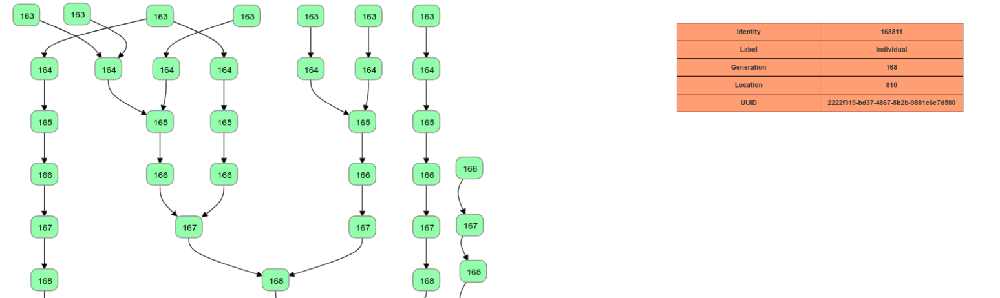
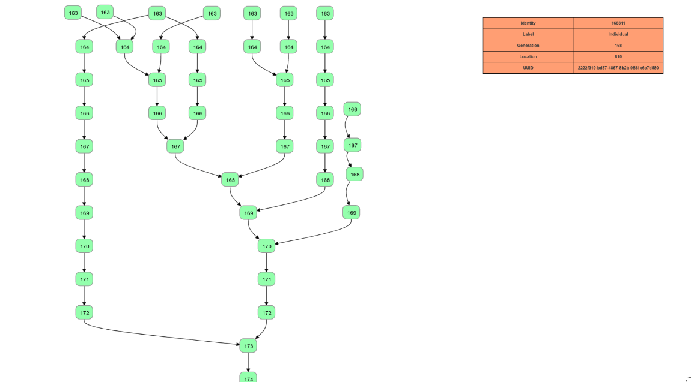

# Final Summary — neo4Jgraphvisualization  



## Project Description  
The work of this project extends from work done by Nic McPhee in visualizing the output of Genetic Programming runs in a graph database. While the specific database of choice for storing this data has shifted over the last several years, it appears as if it will remain in **neo4J** for a while. Genetic Programming runs can contain gigabytes or even terabytes of data, and Nic McPhee has used pdf visualizations of these runs uncover behavior about how Genetic Programming algorithms. However these pdf's have some disadvantages:  
* They can be cumbersome. A large pdf in a pdf viewer such as chrome can take 10 minutes to render. Even though these pdf's allow you to zoom in and examine a subsection of the graph, they still can take anywhere from 15 to 30 seconds to render the subsection if the graph is large.   
* The pdf's can be too cluttered when the information is not filtered to view a subsection very well. It is possible to filter the graph to only include individuals that contributed genetic material to the winner, but these graphs might exclude some important information when viewing a subsection.   

This project aims to remedy some of these issues by building a web based, interactive, and flexible application made to view subsections of the graph in great detail. The overall hope of this project is to create an application that can be used alongside the pdf views to easily examine subsections without the lag in rendering experienced with pdf's. However, in the context of the database project, we are grounding our expectations.  

The goals for the final project are to have a application that can interact with the neo4J database containing EC runs, and visualize that data on the browser in an interactive way. We would like to see nodes from the database make it to the screen, be able to interact with these nodes to find out more information about them, and to use those nodes to add new nodes to the graph.  

## Abstract Representation of Data Models  
The data that we are currently working with consist of several entities and edges between them.

**The list of entities:**
* Individual
* TotalError
* SingleError
* Gene

**The list of edges**
* ParentOf
* HasTotalError
* ContainsError
* HasGene

Our current product is only working with two entities: `{Individual, TotalError}` and two edges: `{ParentOf, HasTotalError}`

These are the structure of the entities the way the database sees them.

**Individual:**

```json
{
  "generation": 176,
  "location": 146,
  "uuid": "fe1d7420-a4ff-4613-a05a-a7ae10c77317"
}
```
**TotalError:**

```json
{
  "TotalError": 0,
  "uuid": "ef896e77-f80d-4d0b-9691-86cb9330ef5a"
}
```
---
The following json is what we receive from our queries to neo4j:

```json
[
  {
    "keys": [
      "n"
    ],
    "length": 1,
    "_fields": [
      {
        "identity": {
          "low": 176147,
          "high": 0
        },
        "labels": [
          "Individual"
        ],
        "properties": {
          "generation": {
            "low": 176,
            "high": 0
          },
          "location": {
            "low": 146,
            "high": 0
          },
          "uuid": "fe1d7420-a4ff-4613-a05a-a7ae10c77317"
        }
      }
    ],
    "_fieldLookup": {
      "n": 0
    }
  }
]

```
Once we receive the data in this format we transform it into appropriate json object which will only contain the information that we need to use.

The following json is result of transforming:

```json
{ "identity": 176147,
  "label": "Individual",
  "generation": 176,
  "location": 146,
  "uuid": "fe1d7420-a4ff-4613-a05a-a7ae10c77317" }

```
## Goals achieved and not achieved  

We achieved all goals for the final project:  
* We interacted with neo4J from the webpage.
* We displayed individuals from the database on the front end in an interactive way.  
* We used the information on the front end to make specific queries to the database.

However, the library we used to create our interactive graph, [dagreD3](https://github.com/cpettitt/dagre-d3) is not actively developed or maintained, and is lacking in documentation. dagreD3 was useful for the final project, but it might not be sustainable for future work. In the future, it will be decided if this project will continue to use dagreD3.  



## Potential for future work  
Shawn and I have plans to continue work on this project throughout the next semester with mentoring from Nic McPhee. If all goes well with the project, we would like to present at undergraduate research conferences such as [MICS](http://micsymposium.org/), and URS. Although, the final goal would be to submit a paper to [GECCO](http://gecco-2018.sigevo.org/index.html/HomePage), an international genetic programming and evolutionary computation conference. Future work to the project includes:
* Learning more about [d3](https://d3js.org/). After researching d3, we should be able to understand the dagreD3 more, and decide if we should continue using it, or if we should move onto something else.
* Displaying edge content. Currently, we do not send the edges in the database to the client. This is for two reasons: 1) Simplicity of this final project, 2) We aren't sure how to change the colour/weight of the edges in dagreD3. In the future, we would like to change the colour and weight of the edges in the diagram to reflect what type of genetic operator it is.
* Allowing for multiple data sets, and for more types of queries. For example, Nic has recently implemented a page rank of all individuals in the data set. A possible action a user could do is ask the database for individuals with the top 10 page rank. Or a user might ask to see a specific individual, and might want to explore its parents and children.
* Cleaning up the UI, and making it look sexy so it impresses people. It doesn't serve any direct goal to the project, but it will help make the application popular among people who aren't connected to the project. Ultimately, UI improvments play a large role in gathering interest.

## Overall Reaction  
Overall this project will lay the ground work for all work we will do next semester. While we have not used any particular skills from any of the databases we have used in the labs, the experience of integrating a database into a project has proved invaluable. Trying to use libraries we did not have time to fully understand was frustrating and scaring at times, with lots of highs and lows. Progress and hope came and left in waves, however, both of us not only learned a lot about the tools, but also about the process of developing outside of classroom. We got along well, and have high hopes of lifting the bar next semester.
